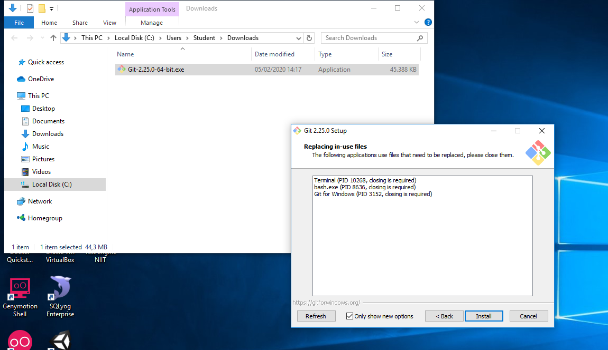
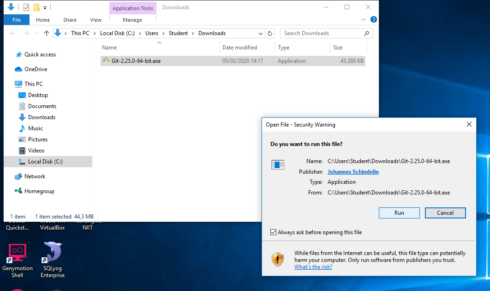
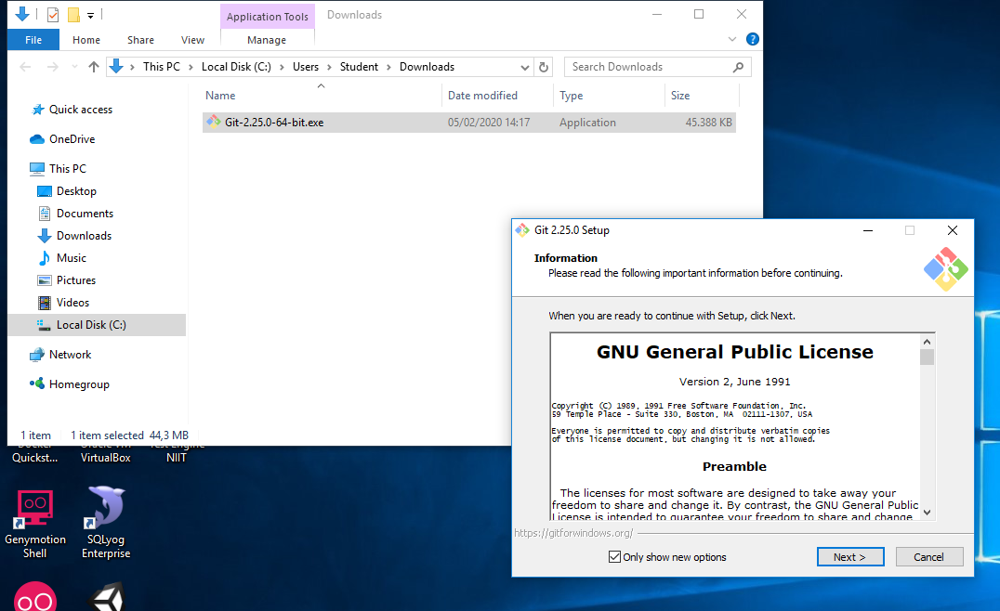
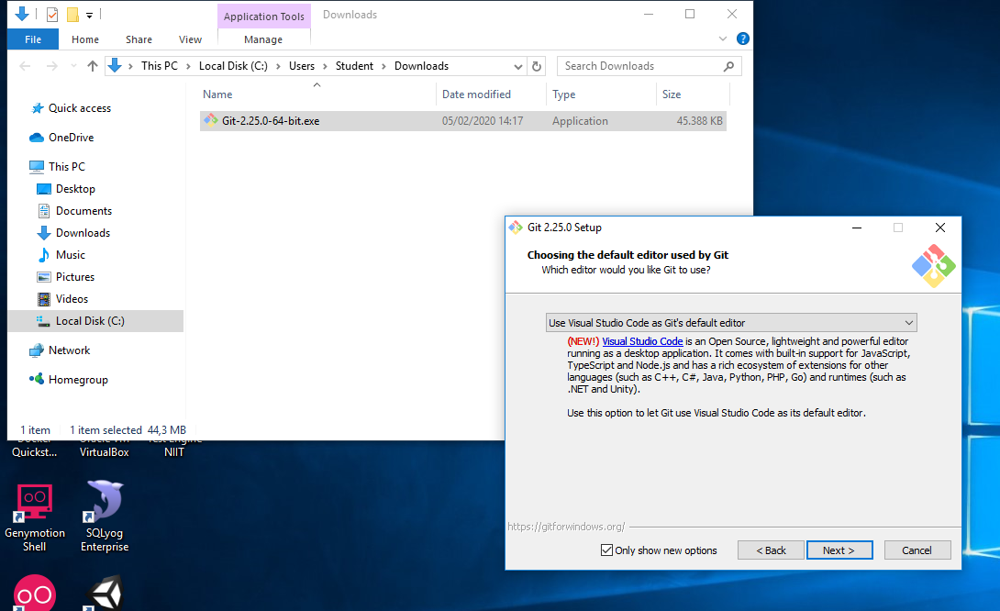
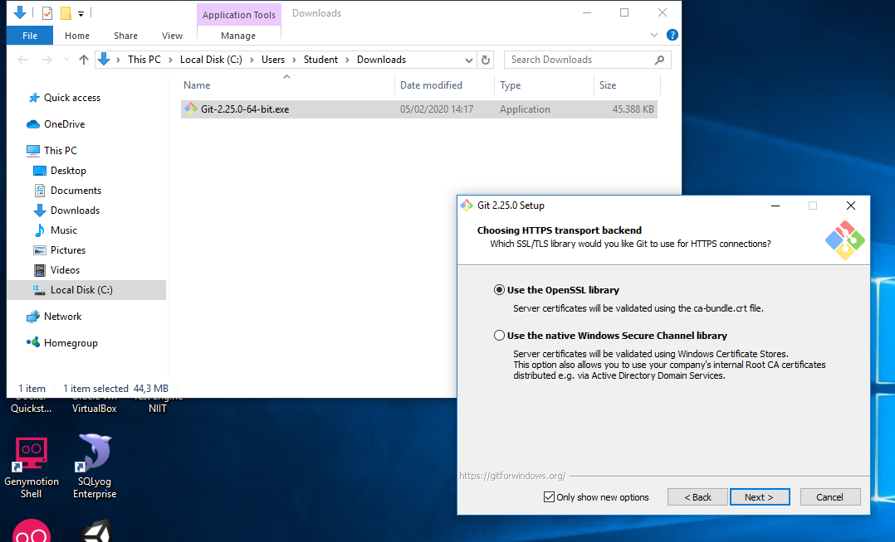
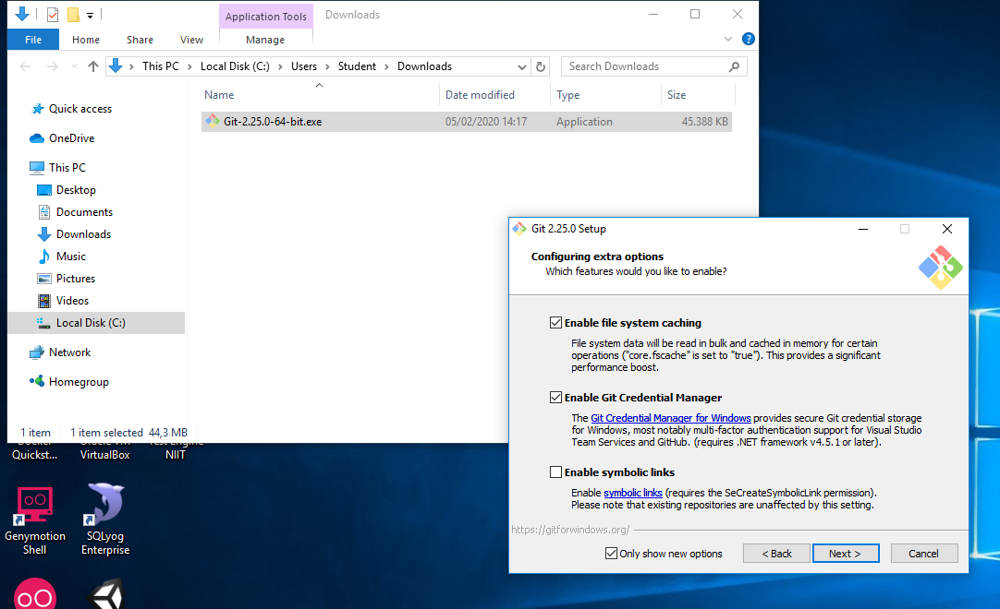
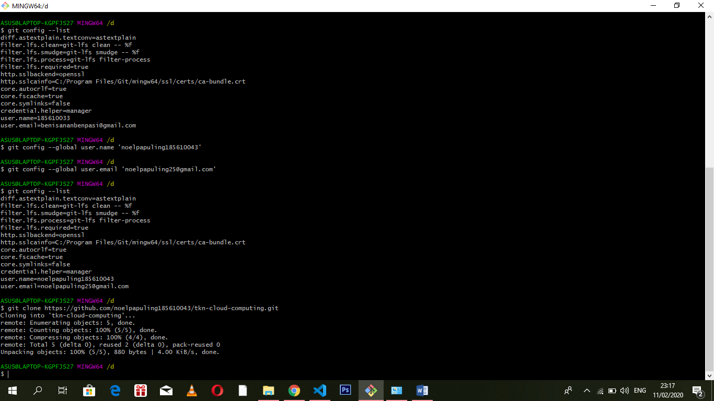
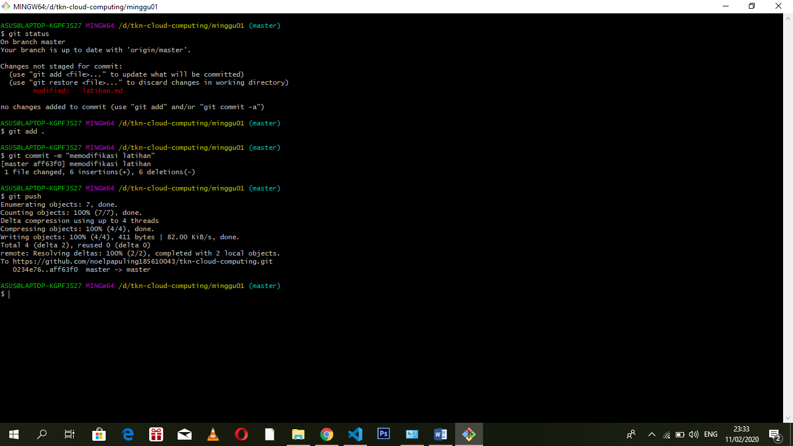

# latihan

## instal git

Wizard pertama kali dimulai dengan Welcome Screen, langsung saja klik Next >
Persetujuan lisensi
Halaman berikutnya adalah informasi mengenai lisensi penggunaan Git, klik Next >

Pilih lokasi instalasi
Selanjutnya kita diminta untuk memilih lokasi instalasi, defaultnya C:\Program Files\Git

Pilih Komponen
Pada bagian ini, kita dapat memilih komponen apa saja yang ingin kita install, atau gunakan pilihan default, selanjutnya klik Next >

Buat nama pada start menu folder
Selanjutnya kita buat nama pada folder start menu, defaultnya adalah Git, setelah selesai, klik Next >

Pilih Environment Git
Bagian ini kita akan memilih bagaimana kita menggunakan Git dari comman line, secara default installer akan memilih Use Git from Git Bash Only, opsi ini tidak akan merubah PATH environment, namun akan membuat perintah Git hanya dapat digunakan menggunkana Git Bash, untuk itu pilih bagian kedua yaitu Use Git from the Windows Command Promt, sehingga kita dapat menjalankan Git dari command promt bawaan windows, hal ini akan memudahkan kita ketika menggunakan Git bersamaan dengan command based program seperti Python Node.js (salah satunya digunakan untuk membuat custom jquery build).

Line Ending Environment
Pada bagian ini kita akan menentukan bagaimana Git memperlakukan line ending (baris baru), karakter line ending sendiri berbeda-beda tergantung sistem operasi yang digunkan, misal: Windows dan Mac OS menggunakan \r\n Mac OS, sedangkan linux menggunakan \n.
Pada pesan yang ada, terdapat istilah LF dan CRLF. LF merupakan kependekan dari Line Feed atau \n, CR kependekan dari Cariage Return atau \r, dan CRLF merupakan gabungan dari keduanya (\r\n). Karena pada Windows yang berlaku adalah CRLF, maka opsi yang pertama adalah yang paling tepat.

Pilih terminal emulator
Bagian ini kita menentukan terminal emulator yang akan kita gunakan ketika  menggunakan terminal Git Bash (Linux style command line), terdapat dua pilihan yaitu menggunakan MinTTY yang dikembangkan dari basis linux atau menggunakan default console pada OS Windows.
Seperti kita ketahui command promt pada windows bersifat fixed size, sehingga tidak dapat diresize, disamping itu history command yang ditampilkan juga terbatas (scroll terbatas), dan perlu untuk melakukan pengaturan agar dapat menggunakan Unicode Font (khususnya non ASCII character), semua keterbatasan tersebut sudah tidak ada di Windows 10

 
File system caching
Pada bagian ini kita memilih apakah menggunakan sistem cache atau tidak, dengan cache akan meningkatkan perfoma aplikasi, namun pada versi yang saya gunakan, fitur ini masih dalam tahap pengembangan, sehingga saya memilih untuk tidak menggunakannya.

Selanjutnya klik Next >

Proses instalasi dimulai
Proses instalasi, seperti extract dan copy file mulai dilakukan, tunggu hingga proses selesai

Proses selesai, klik Finish

## configurasi git

## mengelola repo sendiri

